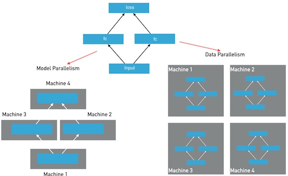
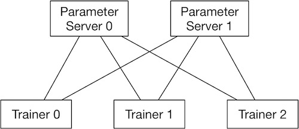
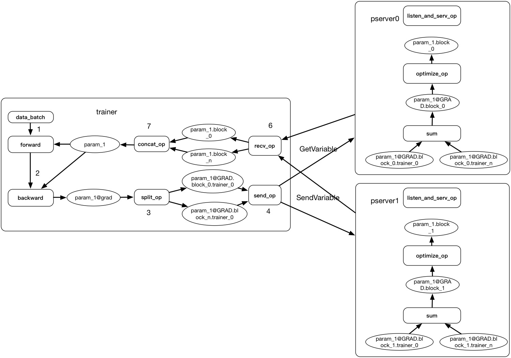
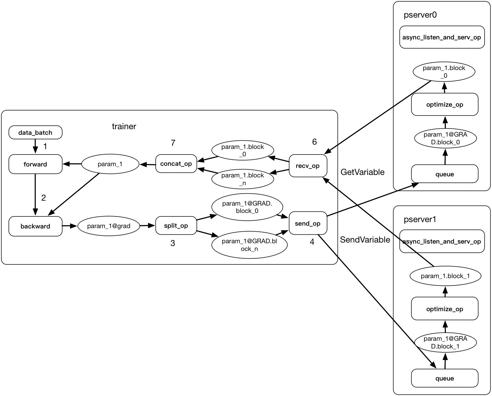
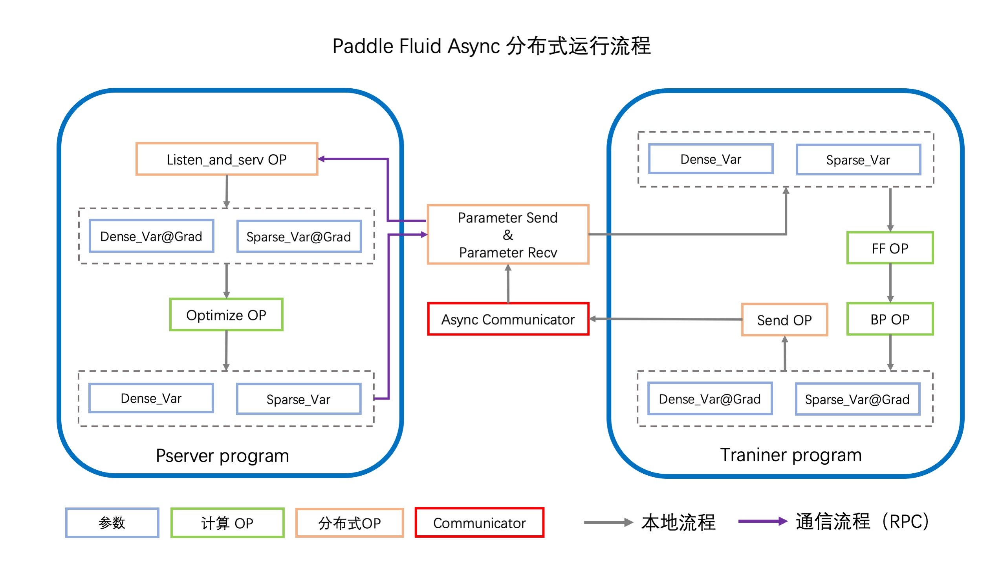
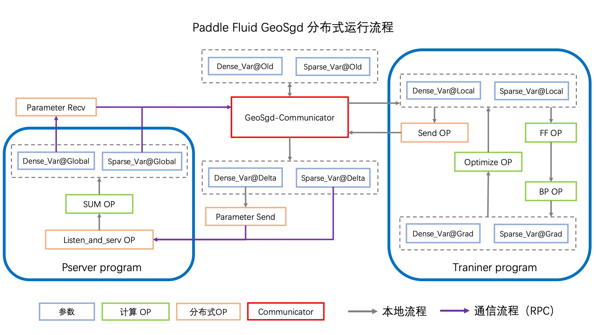

# PaddlePaddle Fluid CPU分布式训练(Transplier)使用指南

通过此文档，希望读者能够了解：
- PaddlePaddle Fluid CPU分布式训练(Transplier)的基本原理及架构设计。
- Transplier目前支持的多种分布式训练的模型及使用异同。
- 分布式任务从数据准备到模型训练到线上预估的全流程。
- 不同业务在不同训练模式下的效果及配置。
- 分布式训练的性能的调试和优化。

## 基本思想
分布式深度学习训练通常分为两种并行化方法：数据并行，模型并行，参考下图：

<br>
在模型并行方式下，模型的层和参数将被分布在多个节点上，模型在一个mini-batch的前向和反向训练中，将经过多次跨节点之间的通信。每个节点只保存整个模型的一部分；
在数据并行方式下，每个节点保存有完整的模型的层和参数，每个节点独自完成前向和反向计算，然后完成梯度的聚合并同步的更新所有节点上的参数。
<br>
Fluid目前版本提供数据并行方式， 在基于CPU的数据并行模式的训练中，Fluid主要使用RPC的通信模式及ParameterServer架构用于应对训练任务对分布式训练的要求，并支持多种训练模式。

基于RPC通信和ParameterServer架构的分布式训练的架构及基本思路是：
- 启动多个pserver进程和多个trainer进程，每个pserver进程会保存一部分模型参数，并负责接收从trainer发送的梯度并更新这些模型参数；每个trainer进程会保存一份完整的模型，并使用一部分数据进行训练，然后向pserver发送梯度，最后从pserver拉取更新后的参数。

- pserver进程可以在和trainer完全不同的计算节点上，也可以和trainer公用节点。一个分布式任务所需要的pserver进程个数通常需要根据实际情况调整，以达到最佳的性能，然而通常来说pserver的进程不会比trainer更多。

- RPC通信方式的结构，参考下图：<br>


### 分布式训练模式
PaddlePaddle Fluid分布式(CPU)训练可以支持同步训练、半异步训练、全异步训练、GeoSGD异步训练4种训练模式。 不同的训练模式适用于不同的场景， 可以跟进需求自行选择适合的训练模式， 我们在文章最后也提供了经典模型在不同模式下的效果和速度的benchmark供用户参考。

#### 同步训练
同步训练方式下，所有的trainer节点，会在每个mini-batch 同步地合并所有节点的梯度数据并发送给parameter server完成更新。
同步训练基本流程，参考下图：

架构设计，及训练流程参考[同步训练](https://github.com/PaddlePaddle/FluidDoc/tree/develop/doc/fluid/design/dist_train#synchronous-training)

#### 半异步训练
半异步训练方式下，每个trainer会等待当前进程内所有训练线程的mini-batch 同步地合并所有节点的梯度数据并发送给parameter server完成更新。
半异步训练基本流程，参考下图：

架构设计，及训练流程参考[半异步训练](https://github.com/PaddlePaddle/FluidDoc/tree/develop/doc/fluid/design/dist_train#asynchronous-training)

#### 全异步训练
全异步训练方式下，每个trainer的每一个训练线程都会将训练的mini-batch 通过一定形式发送给parameter Server， 不会等待其他训练线程，可以独立地更新parameter server的参数。通常情况下，使用异步训练方式，可以在trainer节点更多的时候比同步训练方式有更高的总体吞吐量。
全异步训练的基本流程，参考下图：



#### GEO-SGD 异步训练
GeoSGD全异步训练是PaddlePaddle Fluid 1.6新加入的异步策略，目前只适用于SGD优化算法，此方法能够极大的加速训练。GeoSGD会在每个trainer的本地进行参数优化，每个一定batch，会和Pserver进行一次参数同步。
GeoSGD异步训练基本流程，参考下图：



## 数据准备
PaddlePaddle Fluid目前提供了多种数据读取方式，用于解决不同用户的需求。

- 同步数据读取Feeder请参考：[同步数据读取](https://www.paddlepaddle.org.cn/documentation/docs/zh/user_guides/howto/prepare_data/feeding_data.html)
- 异步数据读取PyReader请参考： [异步数据读取](https://www.paddlepaddle.org.cn/documentation/docs/zh/user_guides/howto/prepare_data/use_py_reader.html)
- 异步数据读取Dataset请参考： [异步数据读取](https://www.paddlepaddle.org.cn/documentation/docs/zh/api_cn/dataset_cn.html)

<br>

- 数据读取性能： Dataset >> PyReader >> Feeder
- 数据接口易用性： Feeder > PyReader = Dataset

训练模式支持： Dataset目前只支持全异步训练(train_from_dataset)模式， Feeder和Pyreader支持全部的训练模式

## 定义网络
在定义网络阶段，Fluid分布式(CPU)训练和单机训练相同。可参考[配置简单的网络](https://www.paddlepaddle.org.cn/documentation/docs/zh/user_guides/howto/configure_simple_model/index_cn.html)

## High-level API
从Paddle Fluid Release 1.5.1 开始，官方推荐使用Fleet API进行分布式训练，关于Fleet API的介绍可以参考[FleetAPI](fleet_api.md)

## 分布式训练模型
单机训练模式不在本章讲述范围内，请参考[单机训练](https://www.paddlepaddle.org.cn/documentation/docs/zh/user_guides/howto/training/single_node.html#id1)

PaddlePaddle Fluid的CPU分布式训练是基于ParameterServer架构设计和实现的，因此在分布式训练任务中，训练节点会被分为pserver节点和trainer节点，共同协作来完成训练任务。

目前全部的训练模式都支持FleetAPI， 推荐用户使用FleetAPI进行分布式训练， 目前FleetAPI及Reader的兼容性如表：

| 训练模式  | FleetAPI |   Feeder  | PyReader | Dataset
| ------------- | ------------- | ------------- | ------------- | ------------- |
| 同步模式 | 支持 | 支持    | 支持     | 不支持
| 半异步模式  | 支持 | 支持    | 支持      | 不支持
| 全异步模式  | 支持 | 支持    | 支持      | 支持
| GeoSGD模式  | 支持 | 支持    | 支持      | 支持

**我们会在下一个版本(v1.7)中，将API全部统一至FleetAPI， 且会让Reader和训练模式实现任意适配。**

### 模型保存
在PaddlePaddle Fluid中，所有的模型变量都用 fluid.framework.Variable() 作为基类。 在该基类之下，模型变量主要可以分为以下几种类别：

模型参数
模型参数是深度学习模型中被训练和学习的变量，在训练过程中，训练框架根据反向传播(backpropagation)算法计算出每一个模型参数当前的梯度， 并用优化器(optimizer)根据梯度对参数进行更新。模型的训练过程本质上可以看做是模型参数不断迭代更新的过程。 在PaddlePaddle Fluid中，模型参数用 fluid.framework.Parameter 来表示， 这是一个 fluid.framework.Variable() 的派生类，除了具有 fluid.framework.Variable() 的各项性质以外， fluid.framework.Parameter 还可以配置自身的初始化方法、更新率等属性。
长期变量
长期变量指的是在整个训练过程中持续存在、不会因为一个迭代的结束而被销毁的变量，例如动态调节的全局学习率等。 在PaddlePaddle Fluid中，长期变量通过将 fluid.framework.Variable() 的 persistable 属性设置为 True 来表示。所有的模型参数都是长期变量，但并非所有的长期变量都是模型参数。
临时变量
不属于上面两个类别的所有模型变量都是临时变量，这种类型的变量只在一个训练迭代中存在，在每一个迭代结束后， 所有的临时变量都会被销毁，然后在下一个迭代开始之前，又会先构造出新的临时变量供本轮迭代使用。 一般情况下模型中的大部分变量都属于这一类别，例如输入的训练数据、一个普通的layer的输出等等。

在分布式训练环境下， 目前提供了save_inference_model和save_persistables两个接口用于模型参数的保存。
如果我们保存模型的目的是用于对新样本的预测，以及进一步做基于C++的预测服务。我们需要使用save_inference_model() 接口来进行模型参数的保存。

如果我们保存模型的目的是用于对新样本的预测，以及进一步做基于C++的预测服务。我们需要使用save_inference_model() 接口来进行模型参数及裁剪后的模型文件的保存。
如果我们保存模型的目的是为了全量获取模型参数以及中间状态， +的预测服务。我们需要使用save_persistables() 接口来进行模型参数的保存。

### 增量训练
增量训练指一个学习系统能不断地从新样本中学习新的知识，并能保存大部分以前已经学习到的知识。因此增量学习涉及到两点：在上一次训练结束的时候保存需要的长期变量， 在下一次训练开始的时候加载上一次保存的这些长期变量。 因此增量训练涉及到如下几个API: fluid.io.save_persistables、fluid.io.load_persistables 。
多机增量训练的一般步骤为：
0号trainer在训练的最后调用 fluid.io.save_persistables 保存持久性参数到指定的 path 下。
通过HDFS等方式将0号trainer保存下来的所有的参数共享给所有的PServer(每个PServer都需要有完整的参数)。
PServer在训练的startup_program通过执行器（Executor）执行成功之后调用 fluid.io.load_persistables 加载0号trainer保存的持久性参数。
PServer通过执行器 Executor 继续启动PServer_program.
所有的训练节点trainer通过执行器 Executor 或者 ParallelExecutor 正常训练。
对于训练过程中待保存参数的trainer， 例如：
```
import paddle.fluid as fluid

exe = fluid.Executor(fluid.CPUPlace())
path = "./models"
trainer_id = 0
if trainer_id == 0:
    prog = fluid.default_main_program()
    fluid.io.save_persistables(exe, path, prog)
```

上面的例子中，0号trainer通过调用 fluid.io.save_persistables 函数，PaddlePaddle Fluid会从默认 fluid.Program 也就是 prog 的所有模型变量中找出长期变量，并将他们保存到指定的 path 目录下。然后通过调用第三方的文件系统（如HDFS）将存储的模型进行上传到所有PServer都可访问的位置。

对于训练过程中待载入参数的PServer， 例如：
```
import paddle.fluid as fluid

exe = fluid.Executor(fluid.CPUPlace())
path = "./models"
pserver_endpoints = "127.0.0.1:1001,127.0.0.1:1002"
trainers = 4
training_role == "PSERVER"
current_endpoint = "127.0.0.1:1002"
config = fluid.DistributeTranspilerConfig()
t = fluid.DistributeTranspiler(config=config)
t.transpile(trainer_id, pservers=pserver_endpoints, trainers=trainers, sync_mode=True, current_endpoint=current_endpoint)

if training_role == "PSERVER":
    pserver_prog = t.get_pserver_program(current_endpoint)
    pserver_startup = t.get_startup_program(current_endpoint, pserver_prog)

    exe.run(pserver_startup)
    fluid.io.load_persistables(exe, path, pserver_prog)
    exe.run(pserver_prog)
if training_role == "TRAINER":
    main_program = t.get_trainer_program()
    exe.run(main_program)
```
上面的例子中，每个PServer通过调用HDFS的命令获取到0号trainer保存的参数，通过配置获取到PServer的 fluid.Program ，PaddlePaddle Fluid会从此 fluid.Program 也就是 pserver_startup 的所有模型变量中找出长期变量，并通过指定的 path 目录下一一加载。
## 模型评估
本地评估：
    本地模型评估方法参考：https://www.paddlepaddle.org.cn/documentation/docs/zh/user_guides/howto/training/test_while_training.html
分布式评估：
    当前Fleet只提供了基于单机的模型评估方法， 分布式评估预计会在v1.7中提供。 
## 准备上线
当我们线下效果测试符合预期并打通训练流程后，下一步就是要上线取得实际的线上收益了。
上线一般需要准备从模型、参数、数据三个方面进行准备：
1. 模型跟进线上需求进行裁剪。
2. 通过save_persistables/save_inference_model保存下来的参数要跟模型文件中的参数名严格对应。
3. 裁剪后的输入要和线上输入保持一致。
## 在线离线一致性校验
在线离线一致性校验主要是为了解决模型在上线过程中，由于人为错误或者模型配置导致的在线预估值和离线预估值之间存在误差，最终导致线上效果不符合预期的检查手段， 主要目的是为了排除模型从模型加载、数据读取、预估等方面是否存在异常，保证模型上线的正确性。
主要做的事情有以下几个方面：
1. 检查模型裁剪是否正确。
2. 模型参数线上加载后和离线环境下是否一致，很多线上业务会用到redis等存储工具来缓存大规模稀疏参数，需要仔细校验参数是否加载正确。
3. 检查在线预测的其他配置是否符合预期，如是否开启FUSE。

## 调试及优化
## benchmark及效果复现
目前Transpiler官方提供2个benchmark模型，分别是基于criteo数据的CTR-DNN和基于1-billion数据的word2vec。
## 其他资料
略